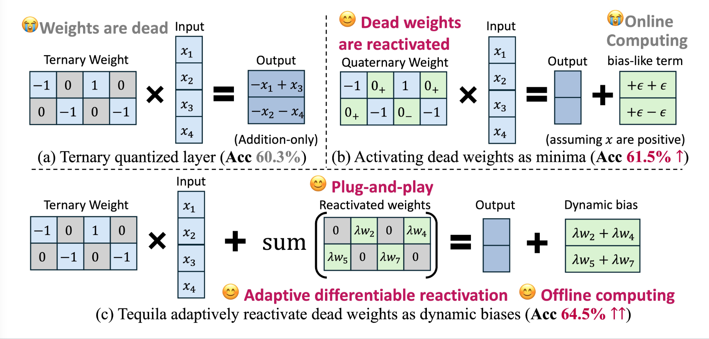

#  Tequila: Trapping-free Ternary Quantization for Large Language Models

This repository is the official implementation of the paper **"Tequila: Trapping-free Ternary Quantization for Large Language Models"**.


## Overview ✨

Tequila is an advanced ternary quantization method that enables efficient deployment of Large Language Models (LLMs) on edge devices by addressing the critical issue of **deadzone trapping**.

|  |
|:---------------------------------------------------------:|


**Key Innovation:** Traditional ternary quantization methods suffer from *deadzone trapping*, where a large number of weights get stuck at the quantization boundary due to uninformative gradients. Tequila solves this by reactivating deadzone-trapped weights and repurposing them as dynamic biases, enabling continuous forward signals and meaningful gradient updates with **near-zero inference overhead**.


## Problem: Deadzone Trapping 🎯
Ternary weight quantization constrains weights to {-1, 0, 1}, replacing expensive multiplications with hardware-efficient additions. However, aggressive compression leads to significant accuracy degradation due to:

- Deadzone Trapping: Weights trapped at quantization boundaries receive only noisy, uninformative gradients
- Stalled Optimization: Trapped weights cannot escape the deadzone, severely limiting model capacity
- Suboptimal Performance: Even with costly quantization-aware training, traditional methods fail to recover full precision performance

## Solution: Tequila Framework 💡
Tequila introduces a novel optimization approach:

1. 🔍 Deadzone Reactivation: Identifies and reactivates trapped weights

2. ⚡ Dynamic Bias Repurposing: Converts trapped weights into dynamic biases

3. 📈 Meaningful Gradients: Enables direct, informative gradient signals during backpropagation

4. 🚀 Zero Overhead Inference: Maintains hardware efficiency while enhancing model capacity


### Performance Highlights 🎯
- **>4% accuracy gain** over state-of-the-art ternary methods on ARC benchmark
- **<1% performance gap** compared to full-precision models
- **3.0× inference speedup** through hardware-efficient additions
- Outperforms SOTA methods across five major benchmarks

## Installation ⚡

```bash
# Install dependencies
pip install -r requirements.txt

# Login to wandb (for experiment tracking)
wandb login
```

## Quick Start 🚀
### Train
```bash
# Run training with RedPajama dataset using DeepSpeed
sh scripts/run_train_redpajama_deepspeed_sample_uqv2_lrud.sh
```

### Evaluate

```bash
# Run evaluation on benchmark tasks
sh script/run_eval.sh
```

